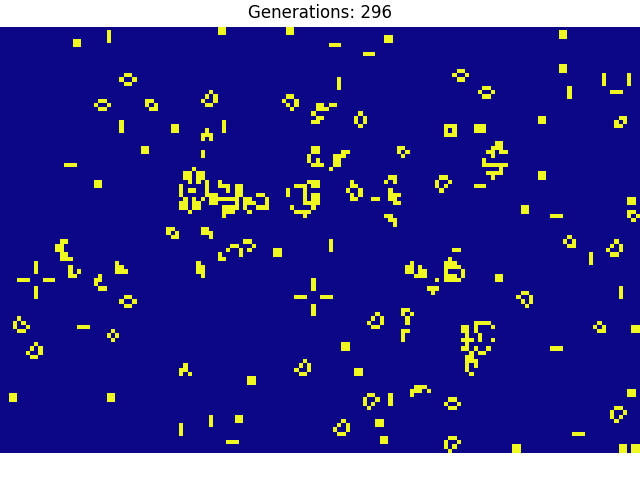

# <center> [Conway's Game of Life](https://en.wikipedia.org/wiki/Conway%27s_Game_of_Life) </center>

<center>
    <figure>
         
        <figcaption>Conway's Game of Life</figcaption> 
    </figure>
</center>

With just three rules, Conway's Game of Life produces an interesting behaviors in a grid world where each cell can be live or dead and just interacts with neighbors.

The three rules are: 

1. Any live cell with two or three live neighbours survives.
2.  Any dead cell with three live neighbours becomes a live cell.
3. All other live cells die in the next generation. Similarly, all other dead cells stay dead.


Something interesting is that, in the time where memory could not be wasted, a lot of effect for video games were developed in this way, in base a rules and not in memory.

## Install

```
pip install .
```

## Run Demo

``` 
conways -h 
```
```
Conway's Game of Life.

Script to simulate Conway's Game of Life.

Usage:
    conways [--save_gif]

Options: 
    --save_gif   Save gif after closing animation. [default: False]

```

## TODO

-  [ ]  Figure out how use ``` plt.show ``` in the right way.
-  [x]  Add capability to choose random of manual initialization.
-  [ ]  Maybe we can built a zoo of infinite machines.


